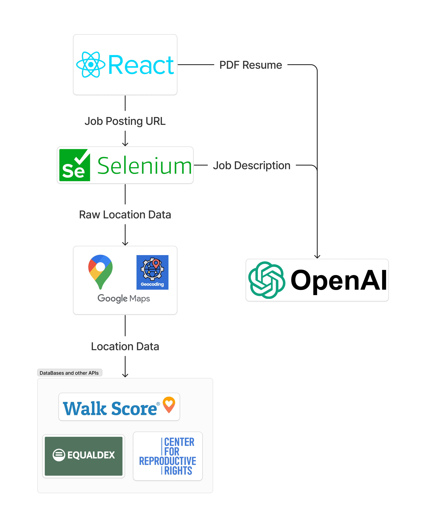

# Job Scoper - HackDavis 2024

## Description

This is Job Scoper, a web application that helps job seekers find the perfect job for them. Job Scoper is a web scraper that analyzes a LinkedIn or Indeed job posting. It gives a detailed description of what it'd be like to live in the city where the job is located. It provides a list of commute options with scores, indications of women's rights issues (like work descrimination laws and reproductive rights), and indications of LGBT+ acceptance.

You can also make use of ChatGPT to compare your resume to the job posting's description!

## Usage

To use Job Scoper, simply copy and paste the URL of a LinkedIn or Indeed job posting into the search bar. Job Scoper will then analyze the job posting and provide you with a detailed description of the city where the job is located.

To make use of the ChatGPT resume analysis feature, simply upload your resume as a PDF. the job description will be automatically compared to your resume.

## Technology Used

## Inspiration

As an LGBT+ person who'd rather not drive to work, I can be a bit picky about where I apply to jobs. Our team wanted to make it easy to vibe check each job posting we came across. That's why we came out with Job Scoper.

## What it does

Simply find a job on Indeed or LinkedIn and grab a link to the posting. Submit it to our Job Scope site and get some insights! Currently, we display commuting information from WalkScore, information about gender discrimination laws and reproductive rights, and LGBT+ acceptance for the area of the job.

You can also submit your resume as a PDF and get a summary of how well your resume fits with the job description - powered by OpenAI.

## How we built it

Our frontend is built from React. We have a flask server hosting an API that gathers all of the information for our front end.

Here's the back end tech:

1. Selenium is used to scrape the job posting from the web to get raw job description and location data.
1. Google Maps API and Google's Geocoding API are used to clean up the raw location data.
